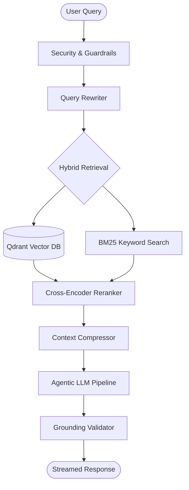

# 🚀 AI Research Assistant: The Ultimate Agentic RAG Platform


A high-performance, resilient, and secure **Retrieval-Augmented Generation (RAG)** engine built with **FastAPI** and **React**. This platform integrates advanced agentic reasoning, hybrid retrieval, cross-encoder reranking, and a multi-layered security architecture to deliver industrial-strength AI research capabilities.

---

## 📖 Project Overview

The **AI Research Assistant** is designed to solve the problem of information overload in large, complex document sets. Unlike standard chat-with-pdf tools, this system employs a **Deep Agentic Pipeline** that can reason about queries, use specialized data-fetching tools (web search, calculators, and API calls), and validate its own answers against source grounding to prevent hallucinations.

### 🔑 Key Capabilities
*   **🧠 Agentic Reasoning**: Powered by LangGraph-style state machines for multi-step problem solving.
*   **🔍 Hybrid Search Architecture**: Combines Dense (Semantic similarity via Qdrant) and Keyword (BM25) search for 100% recall.
*   **🎯 Cross-Encoder Reranking**: Utilizes deep learning to ensure only the most relevant context reaches the LLM.
*   **🛡️ Production-Grade Security**: Built-in protection against prompt injections, input sanitization, and PII filtering.
*   **⚡ Real-Time Streaming**: Low-latency Server-Sent Events (SSE) for a seamless, ChatGPT-like conversation flow.
*   **✅ Truthfulness Guard**: Integrated **Grounding Validator** that cross-references AI answers against retrieved facts to ensure zero hallucinations.

---

## 🏗️ Technical Architecture

The system follows a modern, decoupled micro-services architecture designed for scale:

*   **Frontend (Vite/React)**: A sleek, modern dashboard with a real-time streaming chat, interactive source citations, and live system log monitoring.
*   **Backend (FastAPI)**: An asynchronous Python orchestration layer managing data ingestion, agent execution, and result streaming.
*   **Vector Engine (Qdrant)**: High-speed semantic storage and multi-vector search.
*   **Knowledge Graph (LangChain)**: Orchestrating the complex relationships between documents, tools, and LLM states.

### 🗺️ System Flow Diagram



---

## 🔬 Core Intelligent Services

### 1. Intelligent Duplication Prevention
The system implements a robust ingestion pipeline that avoids data redundancy:
*   **MD5 Hashing**: Every uploaded file is hashed at the bit level.
*   **Vector Registry**: Before ingestion, the system queries the `is_indexed_in_qdrant` registry to check if the specific content (or filename) already exists.

### 2. Context Compression
To optimize token usage and inference speed, the **Context Compressor** dynamically filters out "noise" from retrieved chunks, keeping only the high-density information needed for the answer.

### 3. Truthfulness Validation
The **Grounding Validator** performs a post-inference sanity check. If the LLM generates a claim not supported by the retrieved documents, the system flags it for review or automatically rewrites it to match the source material.

---

## 📂 Project Structure

```plaintext
research-assistant/
├── docs/                # Project documentation and assets
│   └── images/          # Hero images and diagrams
├── backend/             # High-performance FastAPI Engine
│   ├── core/            # AI Logic (Agent, Reranker, Loader)
│   ├── services/        # Orchestration (Security, Validator, Compression)
│   ├── infra/           # Persistence (Qdrant, Redis, SQL)
│   ├── routes/          # API Endpoints
│   ├── main.py          # Entry point
│   └── requirements.txt # Server-side dependencies
├── frontend/            # React + Vite UI
│   ├── src/             # Source code (Components, Pages, Hooks)
│   ├── tailwind.config.js # Modern UI styling
│   └── package.json     # Client-side dependencies
└── .env                 # Environment Configuration
```

---

## 🚀 Setup & Installation

### 1. Backend Setup
```bash
cd backend
python -m venv .venv
source .venv/bin/activate  # Or `.\.venv\Scripts\activate` on Windows
pip install -r requirements.txt
uvicorn main:app --reload --port 8000
```

### 2. Frontend Setup
```bash
cd frontend
npm install
npm run dev
```

---

## 🔒 Configuration

Create a `.env` file in the root with your API keys:

```bash
# Core LLM
GROQ_API_KEY=your_key
OPENAI_API_KEY=your_key_for_embeddings

# Infrastructure
QDRANT_URL=https://your-cluster.qdrant.io
QDRANT_API_KEY=your_qdrant_key
REDIS_URL=redis://localhost:6379

# Tools
TAVILY_API_KEY=your_agent_search_key
```

---

## 🚀 Deployment

### 🌐 Backend (Render)
1. **Runtime**: Python 3
2. **Build Command**: `pip install -r backend/requirements.txt`
3. **Start Command**: `uvicorn backend.main:app --host 0.0.0.0 --port $PORT`

### 🎨 Frontend (Netlify/Vercel)
1. **Build command**: `npm run build`
2. **Publish directory**: `frontend/dist`
3. **Env Var**: `VITE_API_URL` -> Your backend URL.

---

**Developed with 💡 by Steve Philip**
