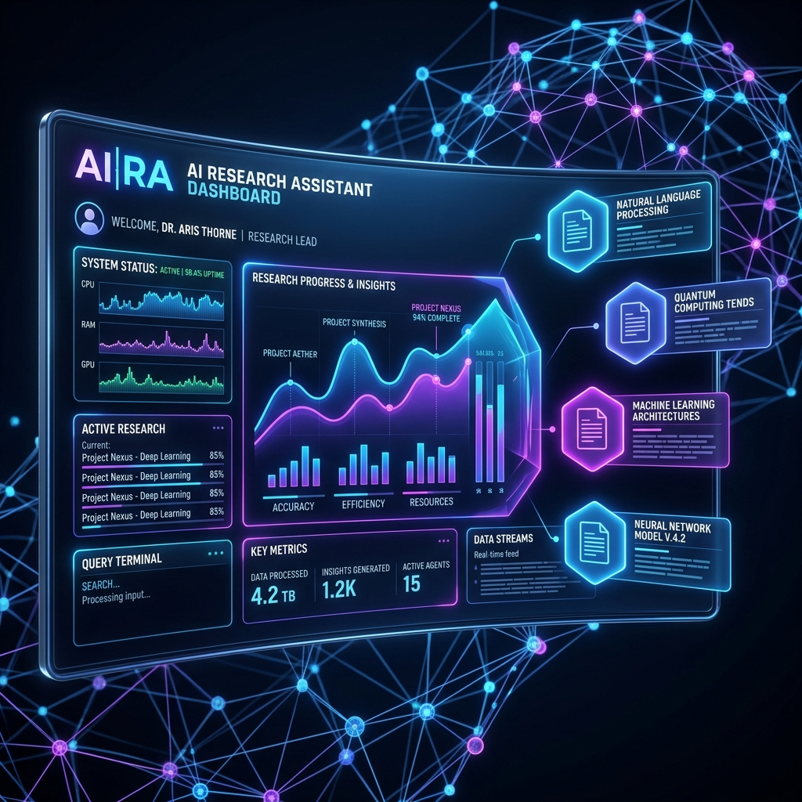

## AI Research Assistant: The Ultimate Agentic RAG Platform



A high-performance, resilient, and secure **Retrieval-Augmented Generation (RAG)** engine built with **FastAPI** and **React**. This platform integrates advanced **LangGraph** orchestration, hybrid retrieval, and a multi-layered verification system to deliver industrially reliable AI research.

---

## 📖 Project Overview

The **AI Research Assistant** solves the "Information Overload" problem by transforming static document sets into a conversational, authoritative knowledge base. Unlike standard chat-with-pdf tools, this system uses a **State-Driven Agentic Pipeline** that can reason about queries, fetch data via hybrid search, and validate every claim against source grounding.

---

## 🚀 Key Features: Enterprise-Grade RAG

### 1. Multi-User Isolation & Security
Built for multi-tenant environments, the platform ensures total data privacy:
*   **Session-Scoped Data**: Every vector point and storage asset is tagged with a unique `session_id`.
*   **Strict Filtering**: Retrieval and tool calls are forced to filter by `session_id`, preventing cross-user data leakage.
*   **Isolated Storage**: Files are stored in session-specific cloud paths (`uploads/{session_id}/`).

### 2. Resource Protection & Guardrails
To ensure stability and fair usage, the system implements:
*   **Document Caps**: Maximum of **5 documents per session** to prevent database bloat.
*   **Size Constraints**: Strict **10MB per file** limit for uploads.
*   **Rate Limiting**: Integrated `SlowAPI` to prevent abuse (3 uploads/min, 5 queries/min).

### 3. Automated Data Lifecycle
*   **Background TTL Purge**: An integrated `APScheduler` job automatically deletes session vectors and artifacts older than **2 hours**.
*   **Event-Driven Cleanup**: Frontend triggers an immediate session purge on tab/browser closure or when starting a "New Chat".

### 4. Premium UX with Real-Time Feedback
*   **Toast Notifications**: A modern, high-visibility notification system for errors (429, 413, network), successes, and server health status.
*   **Live Stream Dashboard**: Real-time telemetry of the agent's internal reasoning steps and retrieval logs.

---

## 🏗️ Technical Architecture: The Agentic Core

### 1. LangGraph State Machine
The core reasoning engine is built using **LangGraph**, providing a deterministic and reliable alternative to chaotic LLM loops.
*   **Agent Node**: The LLM's brain—decides between answering directly or calling tools.
*   **Tools Node**: The LLM's hands—executes vector searches and web queries.
*   **Cyclic Control**: The system continuously loops between nodes until a high-confidence answer is synthesized.


### 2. Intelligent Data Integrity Layer
*   **MD5 Bit-level Hashing**: Every file is uniquely identified by its contents, ensuring bit-perfect deduplication.
*   **Vector Database Registry**: The `is_indexed_in_qdrant` service performs a high-speed lookup in Qdrant, skipping redundant processing.

### 3. Retrieval Intelligence (Hybrid Search)
*   **Dense Search (Qdrant)**: Captures semantic meaning via high-dimensional vector embeddings.
*   **Keyword Search (BM25)**: Captures exact technical terms, IDs, and proper nouns.
*   **Context Compression**: LLM-powered summarization of retrieved chunks ensures only high-density facts are passed to the context window.

---

## 🛡️ Reliability & Safety Guardrails

### 1. Multi-Tier Grounding Validator
To eliminate hallucinations, every answer passes through a rigorous **Grounding Validator**:
*   **Keyword Overlap**: Initial check for word-level consistency.
*   **Substring Match**: Immediate pass if the answer is a direct quotation.
*   **Semantic Check**: A dedicated LLM verifies if the generated claim is supported by the source material.

### 2. Execution Resilience & Telemetry
*   **SafeStream**: A custom wrapper for **Server-Sent Events (SSE)** that delivers tokens reliably via chunk-aware delivery.
*   **Real-Time Telemetry**: Internal state transitions (Retrieved, Validated, Compressed) are emitted via structured `emit_log`.
*   **Timeout & Retries**: All LLM and tool calls implement a **10s timeout** and automated exponential backoff.

---

## 📂 Project Structure

```plaintext
research-assistant/
├── docs/                 # Documentation assets and diagrams
├── backend/              # Production-grade FastAPI Orchestrator
│   ├── main.py           # Application entry point & APScheduler Cleanup
│   ├── core/             # Agentic Brain (LangGraph, Reranker, Telemetry)
│   ├── services/         # Intelligence Layers (Validation, Compression, Security)
│   ├── infra/            # Persistence (Qdrant, Supabase Storage, Redis)
│   ├── utils/            # Resilience Helpers (SafeStreaming, Retries, Hashing)
│   └── scripts/          # Maintenance Tools
├── frontend/             # High-Performance Vite/React UI
│   ├── src/              # App source (Hooks, Components, Pages)
│   └── public/           # Static assets
└── render.yaml           # Deployment & Production manifest
```

## 🛠️ Tech Stack: High-Performance Infrastructure

### Frontend & Dashboard
*   **Vite/React**: Ultra-fast core with component-based interactivity.
*   **Tailwind CSS**: Modern styling for premium design aesthetics.
*   **Toast UI**: Custom notification system for real-time feedback.

### Backend Orchestration
*   **FastAPI (Python 3.10-3.12)**: Asynchronous API Layer for high-concurrency.
*   **LangGraph**: State-driven agentic reasoning (State Machine RAG).
*   **Groq (Llama 3.1 8B)**: Near real-time inference with ultra-low latency.
*   **APScheduler**: Automated background cleanup tasks.

### Vector Intelligence & Knowledge Base
*   **Qdrant Cloud**: Managed vector database with session-aware payload filtering.
*   **Hybrid Search**: Dense semantic and keyword-based retrieval.

---

## 📋 Requirements & Environment Variables

Create a `.env` file in the **`backend/`** directory:

### 🔑 Essential API Keys
*   `GROQ_API_KEY`: `your_groq_key_here`
*   `TAVILY_API_KEY`: `your_tavily_key_here`
*   `QDRANT_URL`: `your_qdrant_cloud_url_here`
*   `QDRANT_API_KEY`: `your_qdrant_api_key_here`
*   `SUPABASE_URL`: `your_supabase_project_url_here`
*   `SUPABASE_KEY`: `your_supabase_anon_key_here`
*   `HF_TOKEN`: `your_huggingface_read_token_here`

### ⚙️ Resource Config (optional)
*   `MAX_DOCS_PER_SESSION`: Default `5`
*   `MAX_FILE_SIZE_MB`: Default `10`

---

## 🚀 Setup & Installation

### 1. Backend Setup
```bash
cd backend
python -m venv .venv
source .venv/bin/activate
pip install -r requirements.txt
uvicorn main:app --reload --port 8000
```

### 2. Frontend Setup
```bash
cd frontend
npm install
npm run dev
```

---

**Developed with 💡 for High-Accuracy Environments by Steve Philip**
