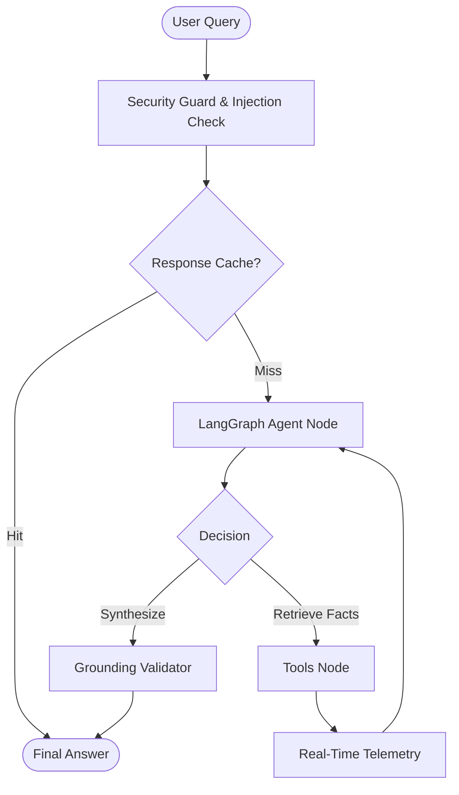

# 🚀 AI Research Assistant: The Ultimate Agentic RAG Platform


A high-performance, resilient, and secure **Retrieval-Augmented Generation (RAG)** engine built with **FastAPI** and **React**. This platform integrates advanced **LangGraph** orchestration, hybrid retrieval, and a multi-layered verification system to deliver industrially reliable AI research.

---

## 📖 Project Overview

The **AI Research Assistant** solves the "Information Overload" problem by transforming static document sets into a conversational, authoritative knowledge base. Unlike standard chat-with-pdf tools, this system uses a **State-Driven Agentic Pipeline** that can reason about queries, fetch data via hybrid search, and validate every claim against source grounding.

---

## 🏗️ Technical Architecture: The Agentic Core

### 1. LangGraph State Machine
The core reasoning engine is built using **LangGraph**, providing a deterministic and reliable alternative to chaotic LLM loops.
*   **Agent Node**: The LLM's brain—decides between answering directly or calling tools.
*   **Tools Node**: The LLM's hands—executes vector searches and web queries.
*   **Cyclic Control**: The system continuously loops between nodes until a high-confidence answer is synthesized.



### 2. Intelligent Data Integrity Layer
*   **MD5 Bit-level Hashing**: Every file is uniquely identified by its contents, ensuring bit-perfect deduplication.
*   **Vector Database Registry**: The `is_indexed_in_qdrant` service performs a high-speed lookup in Qdrant, skipping expensive embedding and chunking for already-indexed content.

### 3. Retrieval Intelligence (Hybrid Search)
*   **Dense Search (Qdrant)**: Captures semantic meaning (e.g., matching "growth" with "expansion").
*   **Keyword Search (BM25)**: Captures exact technical terms, IDs, and proper nouns.
*   **Context Compression**: LLM-powered summarization of retrieved chunks ensures only high-density facts are passed to the context window.

---

## 🛡️ Reliability & Safety Guardrails

### 1. Multi-Tier Grounding Validator
To eliminate hallucinations, every answer passes through a rigorous **Grounding Validator**:
*   **Keyword Overlap**: Initial check for word-level consistency.
*   **Substring Match**: Immediate pass if the answer is a direct quotation.
*   **Semantic Check**: A dedicated LLM post-processor verifies if the generated claim is actually supported by the source material.

### 2. Execution Resilience & Telemetry
*   **SafeStream**: A custom wrapper for **Server-Sent Events (SSE)** that delivers tokens reliably via chunk-aware delivery.
*   **Real-Time Telemetry**: Every internal state transition (Retrieved, Validated, Compressed) is emitted via a structured `emit_log` system, visible in the frontend dashboard.
*   **Tool Guard**: Intercepts and blocks unauthorized or anomalous tool calls before execution.
*   **Timeout & Retries**: All LLM and tool calls implement a **10s timeout** and automated exponential backoff retries.

---

## 📂 Project Structure

```plaintext
research-assistant/
├── docs/                 # Documentation assets and diagrams
├── backend/              # Production-grade FastAPI Orchestrator
│   ├── main.py           # Application entry point & Middleware
│   ├── core/             # Agentic Brain (LangGraph, Reranker, Telemetry)
│   ├── services/         # Intelligence Layers (Validation, Compression, Security)
│   ├── infra/            # Persistence (Qdrant, Supabase Storage, Redis)
│   ├── utils/            # Resilience Helpers (SafeStreaming, Retries, Hashing)
│   └── scripts/          # Maintenance Tools
├── frontend/             # High-Performance Vite/React UI
│   ├── src/              # App source (Live Logs, Streaming Chat)
│   └── public/           # Static assets
└── render.yaml           # Deployment & Production manifest
```

---

## 🚀 Setup & Installation

### 1. Backend Setup
```bash
cd backend
python -m venv .venv
source .venv/bin/activate  # Windows: .\.venv\Scripts\activate
pip install -r requirements.txt
uvicorn main:app --reload --port 8000
```

### 2. Frontend Setup
```bash
cd frontend
npm install
npm run dev
```

---

## ⚙️ Configuration & Maintenance

Configure these flags in the `.env` file to toggle features:
*   `ENABLE_CACHE`, `ENABLE_VALIDATION`, `ENABLE_COMPRESSION`, `ENABLE_TOOL_GUARD`

**Maintenance**:
*   `backend/scripts/reset_qdrant.py`: Deletes and recreates the vector collection.

---

**Developed with 💡 for High-Accuracy Environments by Steve Philip**
